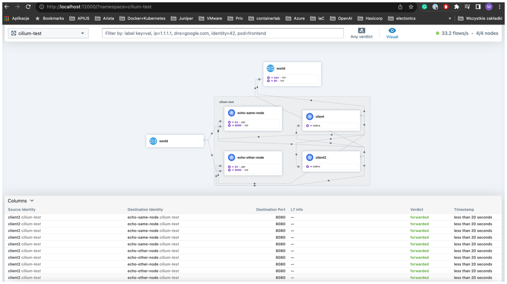

# Isovalent Cillium Quick Start

## Overview

This Quick Start guide demonstrates how to easily create a basic Kubernetes Cluster using Kind, install essential tools like kubectl, and then deploy Cilium CNI along with the CLI tool and Hubble component for visualizing network flows between sample applications PODs.


## Getting Started 
### Prerequisites
 - host with linux and x86 architecture
 - kubectl installed: https://kubernetes.io/docs/tasks/tools/install-kubectl-linux/
 - some time & patience ;) 

## Cluster installation

Quick Start guide focuses on a Kubernetes (K8s) cluster based on Kind. To begin, we need to install Kind. On a standard Linux host, the installation is straightforward. According to Kind's official documentation, we download the binary file directly from the Kind website:

 https://kind.sigs.k8s.io/docs/user/quick-start/#installation

 First of all we must install a kind, we choose std linux as host so according with kind official documentary, we simply download a binary file directly from kind web page:

```bash
# For AMD64 / x86_64
[ $(uname -m) = x86_64 ] && curl -Lo ./kind https://kind.sigs.k8s.io/dl/v0.20.0/kind-linux-amd64

chmod +x ./kind
sudo mv ./kind /usr/local/bin/kind
```

then download simplest kind cluster definition (1xControlPlane + 3xWorker nodes) and create this cluster:


```bash
curl -LO https://raw.githubusercontent.com/cilium/cilium/1.14.5/Documentation/installation/kind-config.yaml
```
it looks really simple:

```bash
cat kind-config.yaml
kind: Cluster
apiVersion: kind.x-k8s.io/v1alpha4
nodes:
- role: control-plane
- role: worker
- role: worker
- role: worker
networking:
  disableDefaultCNI: true

kind create cluster --config=kind-config.yaml
```

You might have seen similar ouput after execution given command:
```bash
❯ kind create cluster --config=kind-config.yaml
Creating cluster "kind" ...
 ✓ Ensuring node image (kindest/node:v1.27.3) 🖼 
 ✓ Preparing nodes 📦 📦 📦 📦  
 ✓ Writing configuration 📜 
 ✓ Starting control-plane 🕹️ 
 ✓ Installing StorageClass 💾 
 ✓ Joining worker nodes 🚜 
Set kubectl context to "kind-kind"
You can now use your cluster with:

kubectl cluster-info --context kind-kind

Not sure what to do next? 😅  Check out https://kind.sigs.k8s.io/docs/user/quick-start/
```

let's try if it started, we need to have `kubectl` installed. If not fix it quickly:

```bash
curl -LO "https://dl.k8s.io/release/$(curl -L -s https://dl.k8s.io/release/stable.txt)/bin/linux/amd64/kubectl"
sudo install -o root -g root -m 0755 kubectl /usr/local/bin/kubectl
```
and quick check:

```bash
❯ kubectl version --client
Client Version: v1.29.0
Kustomize Version: v5.0.4-0.20230601165947-6ce0bf390ce3
❯ kubectl cluster-info --context kind-kind
Kubernetes control plane is running at https://127.0.0.1:40463
CoreDNS is running at https://127.0.0.1:40463/api/v1/namespaces/kube-system/services/kube-dns:dns/proxy

To further debug and diagnose cluster problems, use 'kubectl cluster-info dump'.
```

Our cluster should be invokded:

```bash
❯ kubectl get nodes
NAME                 STATUS     ROLES           AGE     VERSION
kind-control-plane   NotReady   control-plane   6m21s   v1.27.3
kind-worker          NotReady   <none>          6m1s    v1.27.3
kind-worker2         NotReady   <none>          6m      v1.27.3
kind-worker3         NotReady   <none>          6m2s    v1.27.3
```

lack of CNI makes it `NotReady` (as expected ;) )


## Cillium CLI installation

To install the Cilium CLI, follow the instructions on this documentation page: https://docs.cilium.io/en/stable/gettingstarted/k8s-install-default/#install-the-cilium-cli

Execute the following commands step by step:

```bash
CILIUM_CLI_VERSION=$(curl -s https://raw.githubusercontent.com/cilium/cilium-cli/main/stable.txt)
CLI_ARCH=amd64
if [ "$(uname -m)" = "aarch64" ]; then CLI_ARCH=arm64; fi
curl -L --fail --remote-name-all https://github.com/cilium/cilium-cli/releases/download/${CILIUM_CLI_VERSION}/cilium-linux-${CLI_ARCH}.tar.gz{,.sha256sum}
sha256sum --check cilium-linux-${CLI_ARCH}.tar.gz.sha256sum
sudo tar xzvfC cilium-linux-${CLI_ARCH}.tar.gz /usr/local/bin
rm cilium-linux-${CLI_ARCH}.tar.gz{,.sha256sum}
```

hint: remove `\` to make variables available.

Check if it works: 

```bash
cilium version

cilium-cli: v0.15.18 compiled with go1.21.5 on linux/amd64
cilium image (default): v1.14.4
cilium image (stable): v1.14.5
cilium image (running): 1.14.5
```

## Cilium instalation

Issue following command specifing a requested Cillium version:

```bash
❯ cilium install --version 1.14.5
🔮 Auto-detected Kubernetes kind: kind
✨ Running "kind" validation checks
✅ Detected kind version "0.20.0"
ℹ️  Using Cilium version 1.14.5
🔮 Auto-detected cluster name: kind-kind
🔮 Auto-detected kube-proxy has been installed
```

## Validation

```bash
❯ cilium status --wait
    /¯¯\
 /¯¯\__/¯¯\    Cilium:             OK
 \__/¯¯\__/    Operator:           OK
 /¯¯\__/¯¯\    Envoy DaemonSet:    disabled (using embedded mode)
 \__/¯¯\__/    Hubble Relay:       disabled
    \__/       ClusterMesh:        disabled

Deployment             cilium-operator    Desired: 1, Ready: 1/1, Available: 1/1
DaemonSet              cilium             Desired: 4, Ready: 4/4, Available: 4/4
Containers:            cilium             Running: 4
                       cilium-operator    Running: 1
Cluster Pods:          3/3 managed by Cilium
Helm chart version:    1.14.5
Image versions         cilium             quay.io/cilium/cilium:v1.14.5@sha256:d3b287029755b6a47dee01420e2ea469469f1b174a2089c10af7e5e9289ef05b: 4
                       cilium-operator    quay.io/cilium/operator-generic:v1.14.5@sha256:303f9076bdc73b3fc32aaedee64a14f6f44c8bb08ee9e3956d443021103ebe7a: 1
```

Now our cluster is `UP` and `Ready`` to operation

```bash
❯ kubectl get nodes
NAME                 STATUS   ROLES           AGE   VERSION
kind-control-plane   Ready    control-plane   41m   v1.27.3
kind-worker          Ready    <none>          41m   v1.27.3
kind-worker2         Ready    <none>          41m   v1.27.3
kind-worker3         Ready    <none>          41m   v1.27.3
```


and then K8s cluster should look better and READY for futher actions:

```bash
❯ kubectl get nodes
NAME                 STATUS   ROLES           AGE   VERSION
kind-control-plane   Ready    control-plane   41m   v1.27.3
kind-worker          Ready    <none>          41m   v1.27.3
kind-worker2         Ready    <none>          41m   v1.27.3
kind-worker3         Ready    <none>          41m   v1.27.3
```

Final step is to facilitate the builtin check connectivity test:
```bash
❯ cilium connectivity test
ℹ️  Monitor aggregation detected, will skip some flow validation steps
✨ [kind-kind] Creating namespace cilium-test for connectivity check...
✨ [kind-kind] Deploying echo-same-node service...
✨ [kind-kind] Deploying DNS test server configmap...
✨ [kind-kind] Deploying same-node deployment...
✨ [kind-kind] Deploying client deployment...
✨ [kind-kind] Deploying client2 deployment...
✨ [kind-kind] Deploying echo-other-node service...
✨ [kind-kind] Deploying other-node deployment...
✨ [host-netns] Deploying kind-kind daemonset...
✨ [host-netns-non-cilium] Deploying kind-kind daemonset...
ℹ️  Skipping tests that require a node Without Cilium
⌛ [kind-kind] Waiting for deployment cilium-test/client to become ready...
⌛ [kind-kind] Waiting for deployment cilium-test/client2 to become ready...
⌛ [kind-kind] Waiting for deployment cilium-test/echo-same-node to become ready...
⌛ [kind-kind] Waiting for deployment cilium-test/echo-other-node to become ready...
⌛ [kind-kind] Waiting for CiliumEndpoint for pod cilium-test/client-75bff5f5b9-q2v5w to appear...
⌛ [kind-kind] Waiting for CiliumEndpoint for pod cilium-test/client2-88575dbb7-d2pss to appear...
⌛ [kind-kind] Waiting for pod cilium-test/client-75bff5f5b9-q2v5w to reach DNS server on cilium-test/echo-same-node-769767965f-vknxn pod...
⌛ [kind-kind] Waiting for pod cilium-test/client2-88575dbb7-d2pss to reach DNS server on cilium-test/echo-same-node-769767965f-vknxn pod...
⌛ [kind-kind] Waiting for pod cilium-test/client-75bff5f5b9-q2v5w to reach DNS server on cilium-test/echo-other-node-85596c9577-tmxvf pod...
⌛ [kind-kind] Waiting for pod cilium-test/client2-88575dbb7-d2pss to reach DNS server on cilium-test/echo-other-node-85596c9577-tmxvf pod...
⌛ [kind-kind] Waiting for pod cilium-test/client2-88575dbb7-d2pss to reach default/kubernetes service...
⌛ [kind-kind] Waiting for pod cilium-test/client-75bff5f5b9-q2v5w to reach default/kubernetes service...
⌛ [kind-kind] Waiting for CiliumEndpoint for pod cilium-test/echo-other-node-85596c9577-tmxvf to appear...
⌛ [kind-kind] Waiting for CiliumEndpoint for pod cilium-test/echo-same-node-769767965f-vknxn to appear...
⌛ [kind-kind] Waiting for Service cilium-test/echo-other-node to become ready...
⌛ [kind-kind] Waiting for Service cilium-test/echo-other-node to be synchronized by Cilium pod kube-system/cilium-tj7mf
⌛ [kind-kind] Waiting for Service cilium-test/echo-same-node to become ready...
⌛ [kind-kind] Waiting for Service cilium-test/echo-same-node to be synchronized by Cilium pod kube-system/cilium-tj7mf
⌛ [kind-kind] Waiting for NodePort 172.18.0.2:32410 (cilium-test/echo-same-node) to become ready...
⌛ [kind-kind] Waiting for NodePort 172.18.0.2:31605 (cilium-test/echo-other-node) to become ready...
⌛ [kind-kind] Waiting for NodePort 172.18.0.5:31605 (cilium-test/echo-other-node) to become ready...
⌛ [kind-kind] Waiting for NodePort 172.18.0.5:32410 (cilium-test/echo-same-node) to become ready...
⌛ [kind-kind] Waiting for NodePort 172.18.0.3:31605 (cilium-test/echo-other-node) to become ready...
⌛ [kind-kind] Waiting for NodePort 172.18.0.3:32410 (cilium-test/echo-same-node) to become ready...
⌛ [kind-kind] Waiting for NodePort 172.18.0.4:31605 (cilium-test/echo-other-node) to become ready...
⌛ [kind-kind] Waiting for NodePort 172.18.0.4:32410 (cilium-test/echo-same-node) to become ready...
ℹ️  Skipping IPCache check
🔭 Enabling Hubble telescope...
⚠️  Unable to contact Hubble Relay, disabling Hubble telescope and flow validation: rpc error: code = Unavailable desc = connection error: desc = "transport: Error while dialing: dial tcp 127.0.0.1:4245: connect: connection refused"
ℹ️  Expose Relay locally with:
   cilium hubble enable
   cilium hubble port-forward&
ℹ️  Cilium version: 1.14.5
🏃 Running 63 tests ...
[=] Test [no-unexpected-packet-drops] [1/63]

[=] Test [no-policies] [2/63]
............................
[=] Test [no-policies-extra] [3/63]
................
[=] Test [allow-all-except-world] [4/63]
..................
[=] Test [client-ingress] [5/63]

(...)

[=] Skipping Test [outside-to-ingress-service-deny-cidr] [60/63] (Feature ingress-controller is disabled)
[=] Skipping Test [outside-to-ingress-service-deny-all-ingress] [61/63] (Feature ingress-controller is disabled)
[=] Test [dns-only] [62/63]
..........
[=] Test [to-fqdns] [63/63]
........

✅ All 45 tests (306 actions) successful, 18 tests skipped, 1 scenarios skipped.
```

A Hubble component wasn't installed and port associated with this service was no exposed so we have no super-duper clear test result.


During this procedure cilium invokes a dedicated namespace called `cilium-test`:

```bash
❯ kubectl get ns
NAME                 STATUS   AGE
cilium-test          Active   8m47s
default              Active   61m
kube-node-lease      Active   61m
kube-public          Active   61m
kube-system          Active   61m
local-path-storage   Active   61m
❯ kubectl get all -n cilium-test
NAME                                   READY   STATUS    RESTARTS   AGE
pod/client-75bff5f5b9-q2v5w            1/1     Running   0          8m54s
pod/client2-88575dbb7-d2pss            1/1     Running   0          8m54s
pod/echo-other-node-85596c9577-tmxvf   2/2     Running   0          8m54s
pod/echo-same-node-769767965f-vknxn    2/2     Running   0          8m54s
pod/host-netns-228qx                   1/1     Running   0          8m54s
pod/host-netns-bfchn                   1/1     Running   0          8m54s
pod/host-netns-br7n2                   1/1     Running   0          8m54s

NAME                      TYPE       CLUSTER-IP      EXTERNAL-IP   PORT(S)          AGE
service/echo-other-node   NodePort   10.96.136.5     <none>        8080:31605/TCP   8m54s
service/echo-same-node    NodePort   10.96.157.110   <none>        8080:32410/TCP   8m54s

NAME                                   DESIRED   CURRENT   READY   UP-TO-DATE   AVAILABLE   NODE SELECTOR                AGE
daemonset.apps/host-netns              3         3         3       3            3           <none>                       8m54s
daemonset.apps/host-netns-non-cilium   0         0         0       0            0           cilium.io/no-schedule=true   8m54s

NAME                              READY   UP-TO-DATE   AVAILABLE   AGE
deployment.apps/client            1/1     1            1           8m54s
deployment.apps/client2           1/1     1            1           8m54s
deployment.apps/echo-other-node   1/1     1            1           8m54s
deployment.apps/echo-same-node    1/1     1            1           8m54s

NAME                                         DESIRED   CURRENT   READY   AGE
replicaset.apps/client-75bff5f5b9            1         1         1       8m54s
replicaset.apps/client2-88575dbb7            1         1         1       8m54s
replicaset.apps/echo-other-node-85596c9577   1         1         1       8m54s
```


```bash
❯ kubectl exec -it cilium-67j68 -n kube-system  -- bash
Defaulted container "cilium-agent" out of: cilium-agent, config (init), mount-cgroup (init), apply-sysctl-overwrites (init), mount-bpf-fs (init), clean-cilium-state (init), install-cni-binaries (init)
root@kind-worker2:/home/cilium# 

root@kind-worker2:/home/cilium# cilium endpoint list
ENDPOINT   POLICY (ingress)   POLICY (egress)   IDENTITY   LABELS (source:key[=value])                                                         IPv6   IPv4           STATUS   
           ENFORCEMENT        ENFORCEMENT                                                                                                                            
235        Disabled           Disabled          4          reserved:health                                                                            10.244.3.13    ready   
465        Disabled           Disabled          16771      k8s:io.cilium.k8s.namespace.labels.kubernetes.io/metadata.name=kube-system                 10.244.3.134   ready   
                                                           k8s:io.cilium.k8s.policy.cluster=kind-kind                                                                        
                                                           k8s:io.cilium.k8s.policy.serviceaccount=coredns                                                                   
                                                           k8s:io.kubernetes.pod.namespace=kube-system                                                                       
                                                           k8s:k8s-app=kube-dns                                                                                              
487        Disabled           Disabled          8069       k8s:app=local-path-provisioner                                                             10.244.3.230   ready   
                                                           k8s:io.cilium.k8s.namespace.labels.kubernetes.io/metadata.name=local-path-storage                                 
                                                           k8s:io.cilium.k8s.policy.cluster=kind-kind                                                                        
                                                           k8s:io.cilium.k8s.policy.serviceaccount=local-path-provisioner-service-account                                    
                                                           k8s:io.kubernetes.pod.namespace=local-path-storage                                                                
1024       Disabled           Disabled          1          reserved:host                                                                                             ready   
1371       Disabled           Disabled          16771      k8s:io.cilium.k8s.namespace.labels.kubernetes.io/metadata.name=kube-system                 10.244.3.168   ready   
                                                           k8s:io.cilium.k8s.policy.cluster=kind-kind                                                                        
                                                           k8s:io.cilium.k8s.policy.serviceaccount=coredns                                                                   
                                                           k8s:io.kubernetes.pod.namespace=kube-system                                                                       
                                                           k8s:k8s-app=kube-dns                                                                                              
root@kind-worker2:/home/cilium# 
```


```bash
root@kind-worker2:/home/cilium# cilium bpf endpoint list
IP ADDRESS       LOCAL ENDPOINT INFO
172.18.0.2:0     (localhost)                                                                                      
10.244.3.168:0   id=1371  sec_id=16771 flags=0x0000 ifindex=8   mac=DA:D8:BD:AC:A6:C0 nodemac=96:E9:98:4F:8E:1D   
10.244.3.134:0   id=465   sec_id=16771 flags=0x0000 ifindex=10  mac=2A:89:75:FB:0B:61 nodemac=0E:C8:1A:2C:FE:2F   
10.244.3.13:0    id=235   sec_id=4     flags=0x0000 ifindex=6   mac=5A:8A:14:BA:49:09 nodemac=9E:66:D0:93:52:CF   
10.244.3.230:0   id=487   sec_id=8069  flags=0x0000 ifindex=12  mac=6A:26:31:F4:C0:25 nodemac=A6:C0:11:DF:BE:4F   
```

## Hubble installation


First enable hubble on Cillium:

```bash
cilium hubble enable
❯ cilium status
    /¯¯\
 /¯¯\__/¯¯\    Cilium:             OK
 \__/¯¯\__/    Operator:           OK
 /¯¯\__/¯¯\    Envoy DaemonSet:    disabled (using embedded mode)
 \__/¯¯\__/    Hubble Relay:       OK
    \__/       ClusterMesh:        disabled

Deployment             cilium-operator    Desired: 1, Ready: 1/1, Available: 1/1
DaemonSet              cilium             Desired: 4, Ready: 4/4, Available: 4/4
Deployment             hubble-relay       Desired: 1, Ready: 1/1, Available: 1/1
Containers:            hubble-relay       Running: 1
                       cilium             Running: 4
                       cilium-operator    Running: 1
Cluster Pods:          8/8 managed by Cilium
Helm chart version:    1.14.5
Image versions         cilium             quay.io/cilium/cilium:v1.14.5@sha256:d3b287029755b6a47dee01420e2ea469469f1b174a2089c10af7e5e9289ef05b: 4
                       cilium-operator    quay.io/cilium/operator-generic:v1.14.5@sha256:303f9076bdc73b3fc32aaedee64a14f6f44c8bb08ee9e3956d443021103ebe7a: 1
                       hubble-relay       quay.io/cilium/hubble-relay:v1.14.5@sha256:dbef89f924a927043d02b40c18e417c1ea0e8f58b44523b80fef7e3652db24d4: 1
```

and enable port forwarding between hubble components (TCP 4245 between hubble-ui and hubble-relay):
```bash                       
cilium hubble port-forward&
```

Now you need to install a `hubble CLI` to get access to obserbability feauters provided by hubble:

```bash
HUBBLE_VERSION=$(curl -s https://raw.githubusercontent.com/cilium/hubble/master/stable.txt)
HUBBLE_ARCH=amd64
if [ "$(uname -m)" = "aarch64" ]; then HUBBLE_ARCH=arm64; fi
curl -L --fail --remote-name-all https://github.com/cilium/hubble/releases/download/$HUBBLE_VERSION/hubble-linux-${HUBBLE_ARCH}.tar.gz{,.sha256sum}
sha256sum --check hubble-linux-${HUBBLE_ARCH}.tar.gz.sha256sum
sudo tar xzvfC hubble-linux-${HUBBLE_ARCH}.tar.gz /usr/local/bin
rm hubble-linux-${HUBBLE_ARCH}.tar.gz{,.sha256sum}
```
Again be carefull when copy paste and remove additional `\`, if needded:
then you can use:

```bash
❯ hubble status
Healthcheck (via localhost:4245): Ok
Current/Max Flows: 16,048/16,380 (97.97%)
Flows/s: 32.01
Connected Nodes: 4/4
```

to get observed flows use:

```bash
 hubble observe
Dec 28 16:11:48.237: 10.244.1.204:41214 (remote-node) -> 10.244.0.228:4240 (health) to-endpoint FORWARDED (TCP Flags: ACK, PSH)
Dec 28 16:11:48.237: 10.244.1.204 (remote-node) -> 10.244.0.228 (health) to-endpoint FORWARDED (ICMPv4 EchoRequest)
Dec 28 16:11:48.237: 10.244.1.204 (remote-node) <- 10.244.0.228 (health) to-overlay FORWARDED (ICMPv4 EchoReply)
Dec 28 16:11:48.237: 10.244.1.204:41214 (remote-node) <- 10.244.0.228:4240 (health) to-overlay FORWARDED (TCP Flags: ACK, PSH)
Dec 28 16:11:49.177: 10.244.2.53:36310 (remote-node) <- 10.244.0.228:4240 (health) to-overlay FORWARDED (TCP Flags: ACK, PSH)
Dec 28 16:11:49.177: 10.244.2.53:36310 (remote-node) -> 10.244.0.228:4240 (health) to-endpoint FORWARDED (TCP Flags: ACK, PSH)
Dec 28 16:11:49.182: 10.244.2.53 (remote-node) -> 10.244.0.228 (health) to-endpoint FORWARDED (ICMPv4 EchoRequest)
Dec 28 16:11:49.183: 10.244.2.53 (remote-node) <- 10.244.0.228 (health) to-overlay FORWARDED (ICMPv4 EchoReply)
Dec 28 16:11:55.491: 10.244.3.155:59188 (remote-node) <- 10.244.0.228:4240 (health) to-overlay FORWARDED (TCP Flags: ACK)
Dec 28 16:11:55.491: 10.244.3.155:59188 (remote-node) -> 10.244.0.228:4240 (health) to-endpoint FORWARDED (TCP Flags: ACK)
Dec 28 16:12:03.172: 10.244.0.208:38520 (remote-node) <> 10.244.3.13:4240 (health) to-overlay FORWARDED (TCP Flags: AChubble statusK)
Dec 28 16:12:03.175: 10.244.0.208:59790 (remote-node) <> 10.244.1.84:4240 (health) to-overlay FORWARDED (TCP Flags: ACK)
Dec 28 16:12:03.175: 10.244.0.208:50122 (host) <- 10.244.0.228:4240 (health) to-stack FORWARDED (TCP Flags: ACK)
Dec 28 16:12:03.175: 10.244.0.208:50122 (host) -> 10.244.0.228:4240 (health) to-endpoint FORWARDED (TCP Flags: ACK)

```


You can enable UI as well:

```bash
cilium hubble disable
cilium hubble enable --ui

❯ cilium hubble ui
ℹ️  Opening "http://localhost:12000" in your browser...
```



Of course You can check those flows using CLI, ie.:


```bash
hubble observe --pod cilium-test/client2-88575dbb7-d2pss --protocol TCP
Dec 28 16:30:21.261: cilium-test/client2-88575dbb7-d2pss:32776 (ID:51420) -> cilium-test/echo-other-node-85596c9577-tmxvf:8080 (ID:39738) to-endpoint FORWARDED (TCP Flags: SYN)
Dec 28 16:30:21.261: cilium-test/client2-88575dbb7-d2pss:32776 (ID:51420) <- cilium-test/echo-other-node-85596c9577-tmxvf:8080 (ID:39738) to-overlay FORWARDED (TCP Flags: SYN, ACK)
Dec 28 16:30:21.261: cilium-test/client2-88575dbb7-d2pss:32776 (ID:51420) -> cilium-test/echo-other-node-85596c9577-tmxvf:8080 (ID:39738) to-endpoint FORWARDED (TCP Flags: ACK)
Dec 28 16:30:21.263: cilium-test/client2-88575dbb7-d2pss:32776 (ID:51420) -> cilium-test/echo-other-node-85596c9577-tmxvf:8080 (ID:39738) to-endpoint FORWARDED (TCP Flags: ACK, PSH)
Dec 28 16:30:21.265: cilium-test/client2-88575dbb7-d2pss:32776 (ID:51420) <- cilium-test/echo-other-node-85596c9577-tmxvf:8080 (ID:39738) to-overlay FORWARDED (TCP Flags: ACK, PSH)
Dec 28 16:30:21.265: cilium-test/client2-88575dbb7-d2pss:32776 (ID:51420) -> cilium-test/echo-other-node-85596c9577-tmxvf:8080 (ID:39738) to-endpoint FORWARDED (TCP Flags: ACK, FIN)
Dec 28 16:30:21.265: cilium-test/client2-88575dbb7-d2pss:32776 (ID:51420) <- cilium-test/echo-other-node-85596c9577-tmxvf:8080 (ID:39738) to-overlay FORWARDED (TCP Flags: ACK, FIN)
Dec 28 16:30:21.266: cilium-test/client2-88575dbb7-d2pss:32776 (ID:51420) -> cilium-test/echo-other-node-85596c9577-tmxvf:8080 (ID:39738) to-endpoint FORWARDED (TCP Flags: ACK)
Dec 28 16:31:28.491: cilium-test/client2-88575dbb7-d2pss:49928 (ID:51420) -> cilium-test/echo-other-node-85596c9577-tmxvf:8080 (ID:39738) to-endpoint FORWARDED (TCP Flags: SYN)
Dec 28 16:31:28.491: cilium-test/client2-88575dbb7-d2pss:49928 (ID:51420) <- cilium-test/echo-other-node-85596c9577-tmxvf:8080 (ID:39738) to-overlay FORWARDED (TCP Flags: SYN, ACK)
Dec 28 16:31:28.491: cilium-test/client2-88575dbb7-d2pss:49928 (ID:51420) -> cilium-test/echo-other-node-85596c9577-tmxvf:8080 (ID:39738) to-endpoint FORWARDED (TCP Flags: ACK)
Dec 28 16:31:28.493: cilium-test/client2-88575dbb7-d2pss:49928 (ID:51420) -> cilium-test/echo-other-node-85596c9577-tmxvf:8080 (ID:39738) to-endpoint FORWARDED (TCP Flags: ACK, PSH)
Dec 28 16:31:28.494: cilium-test/client2-88575dbb7-d2pss:49928 (ID:51420) <- cilium-test/echo-other-node-85596c9577-tmxvf:8080 (ID:39738) to-overlay FORWARDED (TCP Flags: ACK, PSH)
Dec 28 16:31:28.495: cilium-test/client2-88575dbb7-d2pss:49928 (ID:51420) -> cilium-test/echo-other-node-85596c9577-tmxvf:8080 (ID:39738) to-endpoint FORWARDED (TCP Flags: ACK, FIN)
Dec 28 16:31:28.495: cilium-test/client2-88575dbb7-d2pss:49928 (ID:51420) <- cilium-test/echo-other-node-85596c9577-tmxvf:8080 (ID:39738) to-overlay FORWARDED (TCP Flags: ACK, FIN)
Dec 28 16:31:28.496: cilium-test/client2-88575dbb7-d2pss:49928 (ID:51420) -> cilium-test/echo-other-node-85596c9577-tmxvf:8080 (ID:39738) to-endpoint FORWARDED (TCP Flags: ACK)
Dec 28 16:31:54.510: cilium-test/client2-88575dbb7-d2pss:47264 (ID:51420) <> cilium-test/echo-other-node-85596c9577-tmxvf:8080 (ID:39738) policy-verdict:none INGRESS DENIED (TCP Flags: SYN)
Dec 28 16:31:54.511: cilium-test/client2-88575dbb7-d2pss:47264 (ID:51420) <> cilium-test/echo-other-node-85596c9577-tmxvf:8080 (ID:39738) Policy denied DROPPED (TCP Flags: SYN)
Dec 28 16:31:55.514: cilium-test/client2-88575dbb7-d2pss:47264 (ID:51420) <> cilium-test/echo-other-node-85596c9577-tmxvf:8080 (ID:39738) policy-verdict:none INGRESS DENIED (TCP Flags: SYN)
Dec 28 16:31:55.514: cilium-test/client2-88575dbb7-d2pss:47264 (ID:51420) <> cilium-test/echo-other-node-85596c9577-tmxvf:8080 (ID:39738) Policy denied DROPPED (TCP Flags: SYN)
Dec 28 16:32:03.021: cilium-test/client2-88575dbb7-d2pss:53580 (ID:51420) <- 1.0.0.1:443 (world) to-endpoint FORWARDED (TCP Flags: ACK, PSH)
Dec 28 16:32:03.105: cilium-test/client2-88575dbb7-d2pss:53580 (ID:51420) -> 1.0.0.1:443 (world) to-stack FORWARDED (TCP Flags: ACK, FIN)
Dec 28 16:32:03.113: cilium-test/client2-88575dbb7-d2pss:53580 (ID:51420) <- 1.0.0.1:443 (world) to-endpoint FORWARDED (TCP Flags: ACK, FIN)
Dec 28 16:32:03.113: cilium-test/client2-88575dbb7-d2pss:53580 (ID:51420) -> 1.0.0.1:443 (world) to-stack FORWARDED (TCP Flags: ACK)
```

## What's next?

To further explore Cilium's capabilities, consider deploying a sample/demo application and experimenting with Cilium-based Network Policies. Start with this guide. Give it a try:

https://docs.cilium.io/en/stable/gettingstarted/demo/

My raw output and my console historyyou can find below:

```bash
 5470  kubectl create -f https://raw.githubusercontent.com/cilium/cilium/1.14.5/examples/minikube/http-sw-app.yaml
 5471  kubectl get pods,svc
 5472  kubectl -n kube-system get pods -l k8s-app=cilium
 5473  
 5474  kubectl -n kube-system exec cilium-67j68 -- cilium endpoint list
 5475  kubectl exec xwing -- curl -s -XPOST deathstar.default.svc.cluster.local/v1/request-landing
 5476  kubectl exec tiefighter -- curl -s -XPOST deathstar.default.svc.cluster.local/v1/request-landing
 5477  kubectl create -f https://raw.githubusercontent.com/cilium/cilium/1.14.5/examples/minikube/sw_l3_l4_policy.yaml
 5478  kubectl exec tiefighter -- curl -s -XPOST deathstar.default.svc.cluster.local/v1/request-landing
 5479  kubectl exec xwing -- curl -s -XPOST deathstar.default.svc.cluster.local/v1/request-landing

 5480  kubectl get cnp
 5481  kubectl describe cnp rule1
 5482  kubectl exec tiefighter -- curl -s -XPUT deathstar.default.svc.cluster.local/v1/exhaust-port
 5483  kubectl apply -f https://raw.githubusercontent.com/cilium/cilium/1.14.5/examples/minikube/sw_l3_l4_l7_policy.yaml
 5484  kubectl exec tiefighter -- curl -s -XPOST deathstar.default.svc.cluster.local/v1/request-landing
 5485  kubectl exec tiefighter -- curl -s -XPUT deathstar.default.svc.cluster.local/v1/exhaust-port
 5486  kubectl exec xwing -- curl -s -XPOST deathstar.default.svc.cluster.local/v1/request-landing

 5487  hubble observe --pod deathstar --protocol http
 5488  hubble observe --pod deathstar --verdict DROPPED
```


```bash
kubectl create -f https://raw.githubusercontent.com/cilium/cilium/1.14.5/examples/minikube/http-sw-app.yaml
kubectl create -f https://raw.githubusercontent.com/cilium/cilium/1.14.5/examples/minikube/sw_l3_l4_policy.yaml
kubectl apply -f https://raw.githubusercontent.com/cilium/cilium/1.14.5/examples/minikube/sw_l3_l4_l7_policy.yaml

❯ kubectl describe cnp rule1
Name:         rule1
Namespace:    default
Labels:       <none>
Annotations:  <none>
API Version:  cilium.io/v2
Kind:         CiliumNetworkPolicy
Metadata:
  Creation Timestamp:  2023-12-28T17:48:51Z
  Generation:          2
  Resource Version:    23968
  UID:                 6aec26cc-94e6-4825-9798-46be2fcd8bb3
Spec:
  Description:  L7 policy to restrict access to specific HTTP call
  Endpoint Selector:
    Match Labels:
      Class:  deathstar
      Org:    empire
  Ingress:
    From Endpoints:
      Match Labels:
        Org:  empire
    To Ports:
      Ports:
        Port:      80
        Protocol:  TCP
      Rules:
        Http:
          Method:  POST
          Path:    /v1/request-landing
Events:            <none>
❯  kubectl delete cnp rule1
ciliumnetworkpolicy.cilium.io "rule1" deleted


❯ kubectl create -f https://raw.githubusercontent.com/cilium/cilium/1.14.5/examples/minikube/http-sw-app.yaml
service/deathstar created
deployment.apps/deathstar created
pod/tiefighter created
pod/xwing created
❯ kubectl get pods,svc
NAME                             READY   STATUS              RESTARTS   AGE
pod/deathstar-7848d6c4d5-sjp98   0/1     ContainerCreating   0          4s
pod/deathstar-7848d6c4d5-x9g4w   0/1     ContainerCreating   0          4s
pod/tiefighter                   0/1     ContainerCreating   0          3s
pod/xwing                        0/1     ContainerCreating   0          3s

NAME                 TYPE        CLUSTER-IP      EXTERNAL-IP   PORT(S)   AGE
service/deathstar    ClusterIP   10.96.227.153   <none>        80/TCP    4s
service/kubernetes   ClusterIP   10.96.0.1       <none>        443/TCP   3h43m


❯ kubectl -n kube-system get pods -l k8s-app=cilium
NAME           READY   STATUS    RESTARTS   AGE
cilium-67j68   1/1     Running   0          3h5m
cilium-nhqn5   1/1     Running   0          3h5m
cilium-qqrc5   1/1     Running   0          3h5m
cilium-tj7mf   1/1     Running   0          3h5m

❯ kubectl -n kube-system exec cilium-67j68 -- cilium endpoint list
Defaulted container "cilium-agent" out of: cilium-agent, config (init), mount-cgroup (init), apply-sysctl-overwrites (init), mount-bpf-fs (init), clean-cilium-state (init), install-cni-binaries (init)
ENDPOINT   POLICY (ingress)   POLICY (egress)   IDENTITY   LABELS (source:key[=value])                                                         IPv6   IPv4           STATUS   
           ENFORCEMENT        ENFORCEMENT                                                                                                                            
235        Disabled           Disabled          4          reserved:health                                                                            10.244.3.13    ready   
465        Disabled           Disabled          16771      k8s:io.cilium.k8s.namespace.labels.kubernetes.io/metadata.name=kube-system                 10.244.3.134   ready   
                                                           k8s:io.cilium.k8s.policy.cluster=kind-kind                                                                        
                                                           k8s:io.cilium.k8s.policy.serviceaccount=coredns                                                                   
                                                           k8s:io.kubernetes.pod.namespace=kube-system                                                                       
                                                           k8s:k8s-app=kube-dns                                                                                              
487        Disabled           Disabled          8069       k8s:app=local-path-provisioner                                                             10.244.3.230   ready   
                                                           k8s:io.cilium.k8s.namespace.labels.kubernetes.io/metadata.name=local-path-storage                                 
                                                           k8s:io.cilium.k8s.policy.cluster=kind-kind                                                                        
                                                           k8s:io.cilium.k8s.policy.serviceaccount=local-path-provisioner-service-account                                    
                                                           k8s:io.kubernetes.pod.namespace=local-path-storage                                                                
1024       Disabled           Disabled          1          reserved:host                                                                                             ready   
1371       Disabled           Disabled          16771      k8s:io.cilium.k8s.namespace.labels.kubernetes.io/metadata.name=kube-system                 10.244.3.168   ready   
                                                           k8s:io.cilium.k8s.policy.cluster=kind-kind                                                                        
                                                           k8s:io.cilium.k8s.policy.serviceaccount=coredns                                                                   
                                                           k8s:io.kubernetes.pod.namespace=kube-system                                                                       
                                                           k8s:k8s-app=kube-dns                                                                                              
3238       Disabled           Disabled          44069      k8s:app.kubernetes.io/name=hubble-ui                                                       10.244.3.217   ready   
                                                           k8s:app.kubernetes.io/part-of=cilium                                                                              
                                                           k8s:io.cilium.k8s.namespace.labels.kubernetes.io/metadata.name=kube-system                                        
                                                           k8s:io.cilium.k8s.policy.cluster=kind-kind                                                                        
                                                           k8s:io.cilium.k8s.policy.serviceaccount=hubble-ui                                                                 
                                                           k8s:io.kubernetes.pod.namespace=kube-system                                                                       
                                                           k8s:k8s-app=hubble-ui                                                                                             
❯ kubectl exec xwing -- curl -s -XPOST deathstar.default.svc.cluster.local/v1/request-landing
Ship landed
❯ kubectl exec tiefighter -- curl -s -XPOST deathstar.default.svc.cluster.local/v1/request-landing
Ship landed
❯ kubectl create -f https://raw.githubusercontent.com/cilium/cilium/1.14.5/examples/minikube/sw_l3_l4_policy.yaml
ciliumnetworkpolicy.cilium.io/rule1 created
❯ kubectl create -f https://raw.githubusercontent.com/cilium/cilium/1.14.5/examples/minikube/sw_l3_l4_policy.yaml
Error from server (AlreadyExists): error when creating "https://raw.githubusercontent.com/cilium/cilium/1.14.5/examples/minikube/sw_l3_l4_policy.yaml": ciliumnetworkpolicies.cilium.io "rule1" already exists
❯ kubectl exec xwing -- curl -s -XPOST deathstar.default.svc.cluster.local/v1/request-landing
kubectl get cnp

^C
❯ kubectl get cnp
NAME    AGE
rule1   43s
❯ kubectl describe cnp rule1
Name:         rule1
Namespace:    default
Labels:       <none>
Annotations:  <none>
API Version:  cilium.io/v2
Kind:         CiliumNetworkPolicy
Metadata:
  Creation Timestamp:  2023-12-28T18:14:13Z
  Generation:          1
  Resource Version:    26790
  UID:                 cd1839b9-5154-4f1c-8d47-616a76720e9c
Spec:
  Description:  L3-L4 policy to restrict deathstar access to empire ships only
  Endpoint Selector:
    Match Labels:
      Class:  deathstar
      Org:    empire
  Ingress:
    From Endpoints:
      Match Labels:
        Org:  empire
    To Ports:
      Ports:
        Port:      80
        Protocol:  TCP
Events:            <none>
❯ kubectl exec tiefighter -- curl -s -XPUT deathstar.default.svc.cluster.local/v1/exhaust-port
Panic: deathstar exploded

goroutine 1 [running]:
main.HandleGarbage(0x2080c3f50, 0x2, 0x4, 0x425c0, 0x5, 0xa)
        /code/src/github.com/empire/deathstar/
        temp/main.go:9 +0x64
main.main()
        /code/src/github.com/empire/deathstar/
        temp/main.go:5 +0x85
❯ kubectl apply -f https://raw.githubusercontent.com/cilium/cilium/1.14.5/examples/minikube/sw_l3_l4_l7_policy.yaml
Warning: resource ciliumnetworkpolicies/rule1 is missing the kubectl.kubernetes.io/last-applied-configuration annotation which is required by kubectl apply. kubectl apply should only be used on resources created declaratively by either kubectl create --save-config or kubectl apply. The missing annotation will be patched automatically.
ciliumnetworkpolicy.cilium.io/rule1 configured
❯ kubectl exec tiefighter -- curl -s -XPOST deathstar.default.svc.cluster.local/v1/request-landing
Ship landed
❯ kubectl exec tiefighter -- curl -s -XPUT deathstar.default.svc.cluster.local/v1/exhaust-portkubectl exec tiefighter -- curl -s -XPUT deathstar.default.svc.cluster.local/v1/exhaust-port
kubectl exec tiefighter -- curl -s -XPUT deathstar.default.svc.cluster.local/v1/exhaust-portAccess denied
Access denied
❯ kubectl exec tiefighter -- curl -s -XPUT deathstar.default.svc.cluster.local/v1/exhaust-port
Access denied
❯ kubectl exec xwing -- curl -s -XPOST deathstar.default.svc.cluster.local/v1/request-landing
kubectl exec xwing -- curl -s -XPOST deathstar.default.svc.cluster.local/v1/request-landing^C
❯ kubectl -n kube-system exec cilium-67j68 -- cilium policy get
Defaulted container "cilium-agent" out of: cilium-agent, config (init), mount-cgroup (init), apply-sysctl-overwrites (init), mount-bpf-fs (init), clean-cilium-state (init), install-cni-binaries (init)
[
  {
    "endpointSelector": {
      "matchLabels": {
        "any:class": "deathstar",
        "any:org": "empire",
        "k8s:io.kubernetes.pod.namespace": "default"
      }
    },
    "ingress": [
      {
        "fromEndpoints": [
          {
            "matchLabels": {
              "any:org": "empire",
              "k8s:io.kubernetes.pod.namespace": "default"
            }
          }
        ],
        "toPorts": [
          {
            "ports": [
              {
                "port": "80",
                "protocol": "TCP"
              }
            ],
            "rules": {
              "http": [
                {
                  "path": "/v1/request-landing",
                  "method": "POST"
                }
              ]
            }
          }
        ]
      }
    ],
    "labels": [
      {
        "key": "io.cilium.k8s.policy.derived-from",
        "value": "CiliumNetworkPolicy",
        "source": "k8s"
      },
      {
        "key": "io.cilium.k8s.policy.name",
        "value": "rule1",
        "source": "k8s"
      },
      {
        "key": "io.cilium.k8s.policy.namespace",
        "value": "default",
        "source": "k8s"
      },
      {
        "key": "io.cilium.k8s.policy.uid",
        "value": "cd1839b9-5154-4f1c-8d47-616a76720e9c",
        "source": "k8s"
      }
    ],
    "description": "L7 policy to restrict access to specific HTTP call"
  },
  {
    "endpointSelector": {
      "matchLabels": {
        "any:kind": "echo",
        "k8s:io.kubernetes.pod.namespace": "cilium-test"
      }
    },
    "ingress": [
      {
        "fromEndpoints": [
          {
            "matchLabels": {
              "any:other": "client",
              "k8s:io.kubernetes.pod.namespace": "cilium-test"
            }
          }
        ],
        "toPorts": [
          {
            "ports": [
              {
                "port": "8080",
                "protocol": "TCP"
              }
            ],
            "rules": {
              "http": [
                {
                  "path": "/$",
                  "method": "GET"
                },
                {
                  "path": "/public$",
                  "method": "GET"
                },
                {
                  "path": "/private$",
                  "method": "GET",
                  "headers": [
                    "X-Very-Secret-Token: 42"
                  ]
                }
              ]
            }
          }
        ]
      }
    ],
    "labels": [
      {
        "key": "io.cilium.k8s.policy.derived-from",
        "value": "CiliumNetworkPolicy",
        "source": "k8s"
      },
      {
        "key": "io.cilium.k8s.policy.name",
        "value": "echo-ingress-l7-http",
        "source": "k8s"
      },
      {
        "key": "io.cilium.k8s.policy.namespace",
        "value": "cilium-test",
        "source": "k8s"
      },
      {
        "key": "io.cilium.k8s.policy.uid",
        "value": "fbd2562a-2f1a-41c6-ae33-f76aaccb10c7",
        "source": "k8s"
      }
    ],
    "description": "Allow other client to GET on echo"
  }
]
Revision: 785
❯ kubectl exec -it -n kube-system cilium-kzgdx -- cilium monitor -v --type l7
Error from server (NotFound): pods "cilium-kzgdx" not found
❯ kubectl exec -it -n kube-system cilium-67j68 -- cilium monitor -v --type l7
Defaulted container "cilium-agent" out of: cilium-agent, config (init), mount-cgroup (init), apply-sysctl-overwrites (init), mount-bpf-fs (init), clean-cilium-state (init), install-cni-binaries (init)
Listening for events on 8 CPUs with 64x4096 of shared memory
Press Ctrl-C to quit
^C
Received an interrupt, disconnecting from monitor...


❯ kubectl delete -f https://raw.githubusercontent.com/cilium/cilium/1.14.5/examples/minikube/http-sw-app.yaml
service "deathstar" deleted
deployment.apps "deathstar" deleted
pod "tiefighter" deleted
pod "xwing" deleted


kubectl delete cnp rule1
```